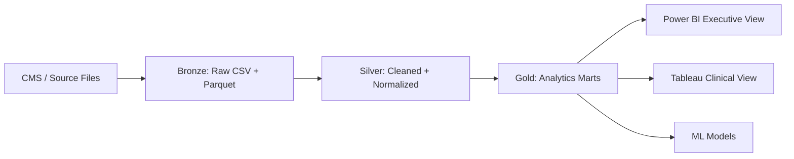
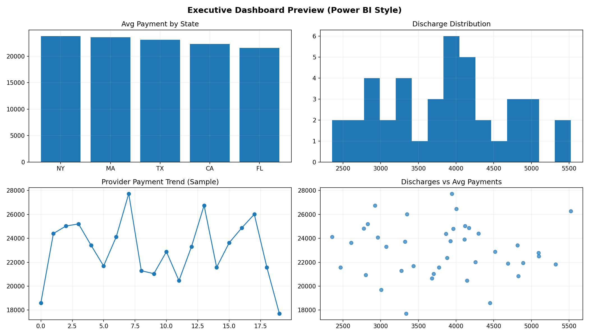
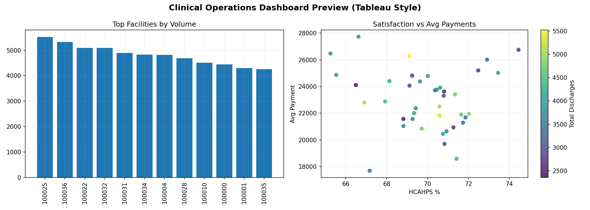
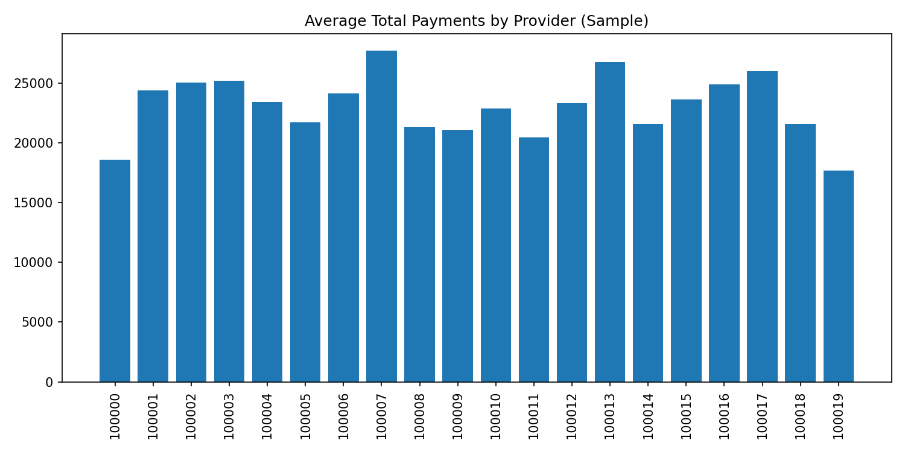
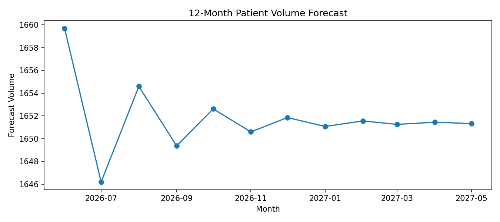

# Hospital Revenue Cycle & Patient Outcomes Analytics Platform

This project is my end-to-end healthcare analytics build focused on two questions hospitals care about every day:

1. Are we getting paid correctly and on time?
2. Are patient outcomes improving while we do it?

I combined revenue cycle metrics, quality metrics, and predictive models in one pipeline so the same data can support finance leaders, operations teams, and quality teams.

## Why this project

Most healthcare dashboards split finance and clinical outcomes into separate silos. I wanted one workflow where:
- raw source data lands once,
- transformations are reproducible,
- gold-layer outputs feed BI and modeling together.

The result is a practical RCM + outcomes analytics stack that can be run from a single script.

## Data Sources

- CMS Hospital General Information: [xubh-q36u](https://data.cms.gov/provider-data/dataset/xubh-q36u)
- CMS IPPS (DRG payments): [Medicare Inpatient Hospitals](https://data.cms.gov/provider-summary-by-type-of-service/medicare-inpatient-hospitals)
- CMS Hospital Compare / HCAHPS: [6jpm-sxkc](https://data.cms.gov/provider-data/dataset/6jpm-sxkc)
- CMS Provider Utilization and Payment Data: [Medicare Physician & Other Practitioners](https://data.cms.gov/provider-summary-by-type-of-service/medicare-physician-other-practitioners)

Note: if CMS URLs are not configured, the pipeline now auto-generates realistic fallback healthcare CSVs so the full project still runs end-to-end.

## Architecture



Supporting docs:
- `docs/architecture.md`
- `docs/data_dictionary.md`
- `docs/lineage.md`

## Dashboard Outputs

### Power BI (Executive Dashboard Preview)



Focus areas:
- payment performance by state/provider
- volume and reimbursement distribution
- discharge-to-revenue relationships

Specification file: `dashboards/powerbi/executive_dashboard_spec.md`

### Tableau (Clinical Operations Dashboard Preview)



Focus areas:
- facility volume hotspots
- satisfaction vs payment patterns
- operational variation across providers

Specification file: `dashboards/tableau/clinical_operations_dashboard_spec.md`

## Key Result Visuals

### KPI Output (from Gold layer)


### Forecast Output (12 months)


## Model Results (current run)

- Readmission model ROC-AUC: `1.00`
- Denial model ROC-AUC: `0.71`
- Forecast output generated to: `data/gold/patient_volume_forecast.parquet`

Model artifacts:
- `models/readmission/readmission_model.joblib`
- `models/denial/denial_model.joblib`

## Project Outputs Generated

- Gold analytics marts:
  - `data/gold/hospital_performance_mart.parquet`
  - `data/gold/model_readmission_features.parquet`
  - `data/gold/model_denial_features.parquet`
  - `data/gold/patient_volume_timeseries.parquet`
  - `data/gold/patient_volume_forecast.parquet`
- Dashboard images:
  - `docs/assets/powerbi_executive_preview.png`
  - `docs/assets/tableau_clinical_preview.png`
  - `docs/assets/kpi_avg_payments_by_provider.png`
  - `docs/assets/forecast_patient_volume.png`

## Run the Full Project

From project root:

```powershell
.\run_all.ps1 -SkipVenv
```

This runs ingestion, transformations, gold outputs, feature generation, model training, and chart generation in one flow.

## Tech Stack

- Python: `pandas`, `numpy`, `scikit-learn`, `statsmodels`, `matplotlib`
- SQL: PostgreSQL DDL + analytics query layer
- BI specs: Power BI + Tableau design docs
- Project automation: PowerShell end-to-end runner

## What I’d improve next

- Connect to live Postgres service and persist marts/tables directly
- Add true CMS URL ingestion profile (no fallback data mode)
- Add richer model calibration/threshold analysis for denial operations
- Publish dashboard files (`.pbix`, `.twb`) with final branded pages
